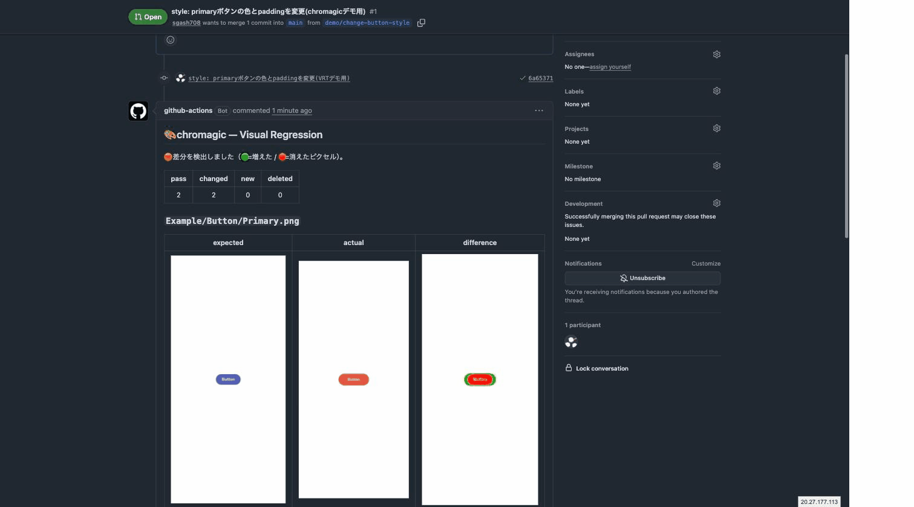

# 🎨 chromagic

**English** | [日本語](README.ja.md)

A **Chromatic-like** Storybook visual regression testing GitHub Action with no external SaaS.
**storycap capture → pixelmatch green/red diff → PR inline comment** (_chroma + magic_).

A replacement for reg-actions. The biggest difference is the **two-color green/red diff** (🟢 = added pixels / 🔴 = removed pixels), which makes **position shifts** obvious at a glance.

## Speed

Every cacheable step (Chrome for Testing binary, npm dependencies, the 61MB Noto CJK font package) is cached automatically — no config needed.

| Run | `chromagic` step duration |
|---|---|
| Cold (first run / no cache yet) | ~31–42s |
| **Warm (cache hit, typical PR run)** | **~16s** |

Measured on a minimal Storybook sample repo, `ubuntu-latest`, 2 vCPU.

## What it looks like

When you open a PR, every changed story gets **expected / actual / difference** side by side in a PR comment:



Here's a closer look — a QtyStepper whose "+" was turned green and given wider spacing (difference: 🔴 = old position / 🟢 = new position):


## Quick start

This is all the calling workflow needs:

```yaml
# .github/workflows/vrt.yaml
name: VRT
on:
  pull_request:
  push: { branches: [main] } # ← required for baseline updates

permissions:
  contents: write # pushes the baseline/report branches
  pull-requests: write # PR comments

jobs:
  vrt:
    runs-on: ubuntu-latest
    steps:
      - uses: actions/checkout@v6
      - uses: oven-sh/setup-bun@v2 # or actions/setup-node
      - run: bun install --frozen-lockfile
      - run: bun run build-storybook # → storybook-static/
      - uses: sgash708/chromagic@v1
        with:
          github-token: ${{ secrets.GITHUB_TOKEN }}
```

- **On PRs**: captures every story → compares against `vrt-baseline` → posts green/red diffs as a PR comment
- **On push to main (= merge)**: saves the current screenshots to `vrt-baseline` (= the next baseline; equivalent to Chromatic's Accept)

> On the first run there is no `vrt-baseline` yet, so every story is "new". **Merge once** to establish the baseline; real diffs appear from the next PR.

## Examples

Ready-to-copy workflows for `.github/workflows/vrt.yaml`:

| File | Use case |
|---|---|
| [`examples/vrt.yaml`](examples/vrt.yaml) | **bun** (recommended) |
| [`examples/vrt-npm.yaml`](examples/vrt-npm.yaml) | **npm / Node.js** (no bun) |
| [`examples/vrt-custom.yaml`](examples/vrt-custom.yaml) | Customized inputs (viewport, sensitivity, branch names, etc.) |

## Inputs

| name | default | description |
|---|---|---|
| `github-token` | (required) | `GITHUB_TOKEN`. Used for posting comments and pushing branches |
| `storybook-static-path` | `storybook-static` | Built Storybook static directory |
| `viewport` | `390x844` | Capture viewport WxH. Comma-separated for multiple viewports (e.g. `390x844,1280x800`) — filenames get a `_WxH` suffix only when more than one is given, so single-viewport setups keep their existing baseline |
| `port` | `6006` | Local port for serving the static build |
| `matching-threshold` | `0.05` | pixelmatch sensitivity (0-1, smaller = more sensitive) |
| `threshold-pixel` | `50` | Stories with more changed pixels than this count as "changed" |
| `baseline-branch` | `vrt-baseline` | Branch holding the baseline images |
| `report-branch` | `vrt-reports` | Branch hosting the images referenced by PR comments |
| `install-fonts` | `true` | Install Noto CJK (prevents tofu for CJK text on Linux) |
| `pages-config` | `chromagic.pages.json` | Config file listing the URLs for page VRT. Page VRT is skipped if it's absent |
| `pages-start-command` | (empty) | Command to start the app for page VRT. Skipped if not set |
| `pages-base-url` | `http://localhost:3000` | Base URL for the started app |
| `pages-login-script` | (empty) | Path to a Playwright login script |
| `pages-health-check-timeout` | `30` | Timeout in seconds while waiting for the app to start |
| `pages-baseline-branch` | `vrt-baseline-pages` | Baseline branch for page VRT |
| `pages-report-branch` | `vrt-reports-pages` | Report branch for page VRT |
| `pages-viewport` | (empty, inherits `viewport`) | Viewport for page VRT |
| `pages-check-name` | `chromagic/pages-approval` | Check run name used for the approval gate |
| `pages-allow-self-approve` | `false` | Set to `true` to let the PR author approve their own `/chromagic approve` (write permission is still required). For solo development with no other reviewer |
| `mode` | `capture` | `capture` or `approve` |
| `storybook` | `true` | Run Storybook VRT (storycap capture + compare). Set to `false` for page-VRT-only consumers with no `storybook-static/` build |

## Outputs

Counts usable in later steps (e.g. fail the job when there are diffs).

| name | description |
|---|---|
| `changed` | Number of stories with diffs |
| `new` | Number of new stories (absent from the baseline) |
| `deleted` | Number of deleted stories |
| `pass` | Number of matching stories |
| `total` | Total number of captured stories |

```yaml
- uses: sgash708/chromagic@v1
  id: vrt
  with:
    github-token: ${{ secrets.GITHUB_TOKEN }}
- if: ${{ steps.vrt.outputs.changed != '0' }}
  run: echo "::warning::${{ steps.vrt.outputs.changed }} visual diff(s) found"
```

## Page VRT (optional)

Beyond Storybook stories, chromagic can also catch visual regressions on the actual deployed screens.

- Starts the app with the consumer-supplied start command (`pages-start-command`) and captures the URLs listed in `chromagic.pages.json`
- For screens that need login, captures storage state first via a consumer-supplied Playwright login script (`pages-login-script`)
- Baselines/reports are kept on separate branches from Storybook (`vrt-baseline-pages` / `vrt-reports-pages`)
- A PR with diffs gets a failing `chromagic/pages-approval` check, and branch protection can block the merge until **someone other than the PR author** comments `/chromagic approve` (and has write access to the repo)
- See [`examples/vrt-pages.yaml`](examples/vrt-pages.yaml) and [`examples/vrt-pages-approve.yaml`](examples/vrt-pages-approve.yaml) for usage

If neither `pages-start-command` nor `pages-config` is set, page VRT doesn't run and only the existing Storybook VRT behavior applies. If you only want page VRT and have no Storybook build, set `storybook: "false"` to skip the storycap capture/compare steps entirely (otherwise storycap fails when `storybook-static/` doesn't exist).

### Security note

The approval gate protects against unreviewed **visual** changes slipping through — it is not a sandbox against a malicious PR's own code.

- For same-repository PRs, GitHub Actions grants the PR's own workflow the same `GITHUB_TOKEN` (with `checks: write`) that chromagic uses. A modified workflow file, a modified `chromagic.pages.json`, or a modified login script could in principle write a `success` check run directly, bypassing the approval flow — this is a general property of any `pull_request`-triggered Actions gate, not something chromagic's code can prevent.
- If you want the approval gate to be meaningful against an adversarial contributor (not just against innocent mistakes), protect your workflow files, `chromagic.pages.json`, and any login script with CODEOWNERS + required reviews (branch protection).
- You must configure branch protection to require the `chromagic/pages-approval` check (or whatever you set `pages-check-name` to) — chromagic cannot enforce that from the action side.

## How it works

- **Capture**: `storycap` (Chrome for Testing provisioned via `setup-chrome`; Noto CJK bundled so CJK text renders correctly).
- **Compare**: `pixelmatch` (`diffColor=red` / `diffColorAlt=green`) generates the two-color diff.
- **Baseline / image hosting**: no external storage. Baselines live on the `vrt-baseline` branch; PR images are pushed to `vrt-reports/<run_id>` branches and referenced from comments via `?raw=true`.
- **Approval**: for intended changes, just **merge the PR into main** and the baseline updates.

## License

[MIT](LICENSE)
